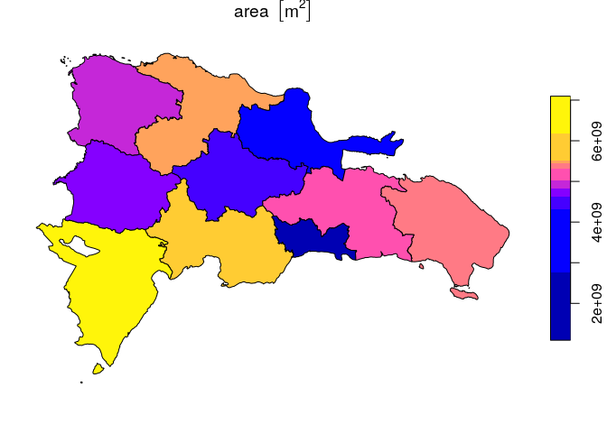
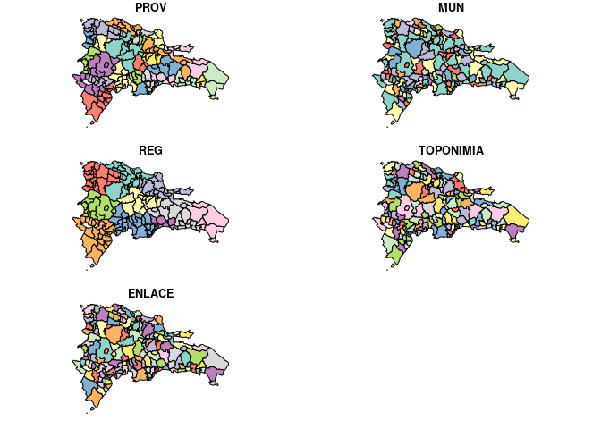
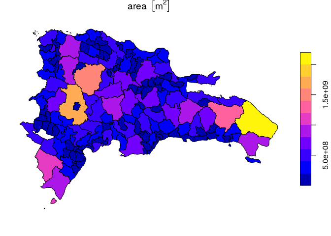

<!-- Este .md fue generado a partir del .Rmd homónimo. Edítese el .Rmd -->

# Introducción a R y análisis exploratorio de datos espaciales (ESDA)

## ¿Por qué R?

**En corto**: R cuenta con múltiples herramientas de análisis espacial y
geoestadística para crear flujos de trabajo reproducibles.

**En detalle**: R cuenta con un “ecosistema” de paquetes para análisis
de datos espaciales [muy
nutrido](https://cran.r-project.org/web/views/Spatial.html), dispone de
una amplia gama de paquetes para análisis estadísticos avanzados, cuenta
con [múltiples herramientas de visualización potentes y
versátiles](https://www.r-graph-gallery.com/), dispone de un entorno de
desarrollo integrado (IDE) orientado a la reproducibilidad y el control
de versiones (e.g. [RStudio](https://rstudio.com/)) Y ES LIBRE. Los
programas basados en interfaz gráfico difícilmente garantizan
reproducibilidad.

<figure>


</figure>

Diferencias en énfasis entre software SIG con interfaz gráfico y R.
Fuente: Lovelace, Nowosad, & Muenchow (2019)

## Introducción a R

### Recursos

Te paso a continuación algunas fuentes (mayoritariamente en español)
sobre las aplicaciones que manejarás y otros recursos.

  - Sobre [R](https://www.r-project.org/)
      - [Vídeo corto sobre la historia de
        R](https://es.coursera.org/lecture/intro-data-science-programacion-estadistica-r/historia-e-introduccion-a-r-alNk0),
        donde podrás aprender algunas las características de R y el
        software libre en general, ventajas y desventajas de R, así como
        algunas aplicaciones.
      - [Libro R4DS, R for Data Science](https://r4ds.had.co.nz/), una
        fuente muy completa realizada principalmente por Wickham &
        Grolemund (2017), con apoyo de la comunidad R. [Fue traducido
        recientemente a español como “R para Ciencia de
        Datos”](https://es.r4ds.hadley.nz/) por la comunidad de R de
        Latinoamérica, y tiene por objetivo hacer R más accesible en la
        región. Es un buen punto de partida. La organización del libro,
        que priorice el aparato gráfico sobre la parte programática,
        ayudan a mantener la motivación en el aprendizaje de R. Seguiré
        este esquema, pero usando datos ecológicos, tanto para las
        asignaciones, como para este guión de referencia.
      - [Esta web](https://oscarperpinan.github.io/R/) es bastante
        completa, y es a la vez un buen lugar de referencia.
      - [Este
        libro](https://cran.r-project.org/doc/contrib/rdebuts_es.pdf)
        está organizado con enfoque de programación, todo un clásico.
      - La existencia de una diversa y activa comunidad R, motiva a
        muchos/as usuarios/as a usar este entorno de programación.
        [Abajo](#twitter) coloqué algunas cuentas de Twitter donde
        podrás observar en vivo una mínima parte de la actividad de la
        comunidad R. Hay muchas otras cuentas, foros, sitios web e
        incluso reuniones periódicas donde podrás interactuar con la
        comunidad. Te animo a descubrirlas.
      - [RStudio](https://www.rstudio.com/). Tanto la página de
        Wikipedia como [este
        vídeo](https://www.youtube.com/watch?v=5XeFFoTf2IY) explican
        muy bien en qué consiste este entorno de desarrollo integrado,
        además de que hace una breve introducción a qué es R.
  - [Git](https://git-scm.com/). Bueno, esta es una larga historia, que
    parece estar bien resumida en
    [Wikipedia](https://es.wikipedia.org/wiki/Git). Busca en YouTube, y
    verás otros aportes.
  - [GitHub](https://github.com/). Se erige como un servicio público
    para desarrolladores y desarrolladoras. Luce bien explicado
    [aquí](https://www.deustoformacion.com/blog/programacion-diseno-web/que-es-para-que-sirve-github).
  - [GitHub Classroom](https://github.com/education/classroom%5D). En
    [esta
    web](https://www.genbeta.com/desarrollo/classroom-for-github-ayudando-a-los-profesores-a-gestionar-los-ejercicios-de-sus-clases)
    te explican para qué sirve. Con este servicio estoy asignándote
    trabajo. También te recomiendo que leas [ésta
    afirmación](https://github.com/education/classroom#who-is-classroom-for).
  - Foros de ayuda y listas de distribución, entre los que destacan
    [R-help](https://stat.ethz.ch/mailman/listinfo/r-help),
    [R-devel](https://stat.ethz.ch/mailman/listinfo/r-devel),
    [Stackoverflow](https://stackoverflow.com/). Las preguntas deben
    plantearse con un ejemplo reproducible. Si vas a plantear una, lee
    antes las guías de publicación. Existe una [lista de distribución de
    R-help en español](https://stat.ethz.ch/mailman/listinfo/r-help-es),
    así como de [Stackoverflow en
    español](https://es.stackoverflow.com/).
  - <a name="twitter"></a>Twitter:
      - [The R Foundation](https://twitter.com/_r_foundation)
      - [RStudio](https://twitter.com/rstudio)
      - [RLadies](https://twitter.com/RLadiesGlobal)
      - [We Are R-Ladies](https://twitter.com/WeAreRLadies)
      - [Comunidad R Hispano](https://twitter.com/r_hisp?lang=es)
      - [Hadley Wickham](https://twitter.com/hadleywickham)
      - [Gabriela de Queiroz](https://twitter.com/gdequeiroz)
      - [R Consortium](https://twitter.com/rconsortium)
      - [UseR\! 2020](https://twitter.com/useR2020stl)
      - [UseR\! 2019](https://twitter.com/UseR2019_Conf)
      - [Rstats](https://twitter.com/rstatstweet)

### Instalación y ejecución de R y RStudio

  - Puedes usar el servidor RStudio habilitado por el profesor. Habrás
    recibido un correo electrónico con los detalles de acceso.

  - Si prefieres trabajar en tu propia PC, instala R y RStudio. La guía
    de instalación varía mucho según el sistema
        operativo:
    
      - [R](https://cloud.r-project.org/)
      - [RStudio](https://www.rstudio.com/products/rstudio/download/#download)

  - Igualmente, la forma de ejecutar estas aplicaciones dependerá del
    sistema operativo.
    
      - En GNU/Linux es posible ejecutar tanto aplicaciones tanto desde
        el gestor de ventanas como desde el intérprete de línea de
        órdenes (CLI) o “terminal” (por ejemplo, para ejecutar R,
        presiona `CRTL+ALT+T`, escribe `R` y presiona `<enter>`).
      - En Windows y MacOS la ejecución se realiza desde el GUI.

### CRAN (Comprehensive R Archive Network)

  - [¿Qué es
    CRAN?](https://cran.r-project.org/doc/FAQ/R-FAQ.html#What-is-CRAN_003f)
  - Instalar paquetes: Ejemplo: `install.packages('vegan', dependencies
    = T)`. Si realizas tus asignaciones en el servidor RStudio
    habilitado por el profesor, no necesitarás instalar paquetes.

### Ayuda de R

``` r
help(package = 'base') #Ayuda sobre un paquete
library(help = 'base') #Documentación sobre un paquete
help(lm) #Ayuda sobre una función
?lm #Ídem
example(lm) #Ejemplo(s) sobre una función
## 
## lm> require(graphics)
## 
## lm> ## Annette Dobson (1990) "An Introduction to Generalized Linear Models".
## lm> ## Page 9: Plant Weight Data.
## lm> ctl <- c(4.17,5.58,5.18,6.11,4.50,4.61,5.17,4.53,5.33,5.14)
## 
## lm> trt <- c(4.81,4.17,4.41,3.59,5.87,3.83,6.03,4.89,4.32,4.69)
## 
## lm> group <- gl(2, 10, 20, labels = c("Ctl","Trt"))
## 
## lm> weight <- c(ctl, trt)
## 
## lm> lm.D9 <- lm(weight ~ group)
## 
## lm> lm.D90 <- lm(weight ~ group - 1) # omitting intercept
## 
## lm> ## No test: 
## lm> ##D anova(lm.D9)
## lm> ##D summary(lm.D90)
## lm> ## End(No test)
## lm> opar <- par(mfrow = c(2,2), oma = c(0, 0, 1.1, 0))
## 
## lm> plot(lm.D9, las = 1)      # Residuals, Fitted, ...
```

<!-- -->

    ## 
    ## lm> par(opar)
    ## 
    ## lm> ## Don't show: 
    ## lm> ## model frame :
    ## lm> stopifnot(identical(lm(weight ~ group, method = "model.frame"),
    ## lm+                     model.frame(lm.D9)))
    ## 
    ## lm> ## End(Don't show)
    ## lm> ### less simple examples in "See Also" above
    ## lm> 
    ## lm> 
    ## lm>
    help.search("matrix") #Busca la palabra clave en las ayudas de los paquetes
    ??matrix #Ídem

¡Usa los foros\! Si introduces un mensaje de error de R en el buscador
de tu preferencia (en inglés obtienes más resultados), encontrarás
varios punteros a foros con posibles soluciones.

## Análisis exploratorio de datos espaciales (ESDA)

Carguemos los paquetes que necesitaremos para esta breve introducción.

``` r
library(sf)
library(raster)
library(rgdal)
library(tidyverse)
library(readxl)
library(tmap)
```

Brevemente, con `sf` crearás y manipularás *simple features*, `raster`
te ayudará a manipular y analizar imágenes de dicho modelo, con `rgdal`
tendrás varias funciones *wrapper* para trabajar con `gdal`desde R,
`tidyverse` carga una colección de paquetes para manipular, limpiar y
organizar datos de `data.frame`, `readxl` te permitirá cargar archivos
Excel, y con `tmap` crearás mapas y los personalizarás. Busca más
información sobre estos paquetes, y comprobarás las múltiples
capacidades de R para manipular información espacial.

El siguiente bloque de código carga las regiones del país según la
división de 2010, a partir de un archivo GeoPackage, originalmente
*shapefiles* de la Oficina Nacional de Estadística (ONE) (2015). Además
de las regiones, este GPKG contiene dos capas adicionales, provincias y
municipios, que cargaremos más
adelante.

``` r
reg.sf <- st_read(dsn = 'data/divisionRD.gpkg', layer = 'REGCenso2010', quiet = T)
plot(reg.sf)
```

<!-- -->

La función `st_read` lee la capa correspondiente del GPKG y la convierte
a un `simple features` de tipo `MULTIPOLYGON`. Este tipo de objetos los
analizaremos más adelante; por lo pronto, probemos algunas
visualizaciones más. Las regiones fueron coloreadas en función de los
campos `REG` y `TOPONIMIA`, pero se puede crear un campo de área
(simple, en m<sup>2</sup>) y aplicar estilos al mapa en función de éste.

``` r
reg.sf$area <- st_area(reg.sf)
plot(reg.sf['area'])
```

<!-- -->

> Este mapa es mejorable en muchos aspectos. En este mismo tutorial,
> probarás formas de diseñar mapas estilizados.

El bloque de código a continuación carga la capa de municipios desde el
GPKG.

``` r
mun.sf <- st_read(dsn = 'data/divisionRD.gpkg', layer = 'MUNCenso2010', quiet = T)
plot(mun.sf)
```

<!-- -->

``` r
mun.sf$area <- st_area(mun.sf)
plot(mun.sf['area'])
```

<!-- -->

``` r
nrow(mun.sf)
## [1] 155
```

Veamos cuestiones básicas sobre el formato usado. *Simple features* es
un estándar abierto y jerárquico del Open Geospatial Consortium
(organización sin ánimo de lucro que agrupa a entidades públicas y
privadas comprometida con la creación de estándares abiertos). *Simple
features* representa al menos 17 tipos de geometría, de las que 7 son
ampliamente usadas en análisis espacial (ver figura a continuación).
Este estándar se integra en R con el paquete `sf` (Pebesma, 2018).

<figure>


</figure>

Tipos de *simple features* admitidos por el paquete `sf`. Fuente:
Lovelace et al. (2019)

``` r
pop.mun <- read_xls('pop_adm3.xls')
pop.mun
nrow(pop.mun)
pop.mun <- pop.mun %>%
  mutate(ENLACE = ifelse(
    nchar(Code)==5,
    paste0('0', Code),
    Code)
  )
match(mun.sf$ENLACE, pop.mun$ENLACE)

mun.sf.sex <- mun.sf %>% 
  inner_join(pop.mun) %>% 
  select(Hombres, Mujeres, TOPONIMIA) %>% 
  mutate(Total=Hombres+Mujeres)
plot(mun.sf.sex, breaks = 'jenks')
pop.mun.hom <- plot(mun.sf.sex['Hombres'], breaks = 'jenks')

dev.new()
mun.sf.sex %>%
  select(-TOPONIMIA) %>% 
  gather(variable, value, -geometry) %>%
  ggplot(aes(fill=value)) +
  geom_sf() +
  facet_wrap(~variable)

p1 <- tm_shape(mun.sf.sex) +
  tm_fill(col = "Hombres", style = 'jenks') +
  tm_borders()
p2 <- tm_shape(mun.sf.sex) +
  tm_fill(col = "Mujeres", style = 'jenks') +
  tm_borders()
p3 <- tm_shape(mun.sf.sex) +
  tm_fill(col = "Total", style = 'jenks') +
  tm_borders()
tmap_arrange(p1, p2, p3)

p1text <- tm_shape(mun.sf.sex) +
  tm_fill(col = "Hombres", style = 'jenks') +
  tm_borders() +
  tm_text('TOPONIMIA', size = 0.4)
tmap_arrange(p1text)
```

## Conclusión

Conociste las herramientas básicas para realizar un EDA ágilmente y
generando gráficos informativos. **El EDA es un paso imprescindible en
cualquier investigación**, así que, ya que no te lo podrás saltar, es
necesario que practiques con los datos de ejemplo mostrados aquí, o con
los tuyos propiamente.

Aunque los paquetes de análisis de datos ecológicos no están
“saborizados” al estilo `tidyverse`, al menos el EDA lo podrás
realizar utilizando tuberías de esta potente colección de paquetes.
Conocerás más herramientas de `tidyverse` en el siguiente capítulo de
esta novela.

## Situaciones comunes

  - R es sensible a las mayúsculas. No es lo mismo `Mi_objeto` que
    `mi_objeto`.
  - *“En RStudio, ¿Qué atajo de teclado es que usan para poner el
    operador de asignación `<-`?”* Debería funcionarte `ALT+-`, pero
    recuerda, sólo lo podrás usar en RStudio.
  - *“¿Y el pipe `%>%`?”* `CTRL+SHIFT+M`.
  - Más atajos de teclado de RStudio: `ALT+SHIFT+K`.
  - *“Me quedé trancá’ en la consola de R con un signo de `+`. ¿Qué hago
    pa’ salir de eso?”* Suele resolverse presionando la tecla `Escape`
    (`Esc`). Lee [este
    texto](https://support.rstudio.com/hc/en-us/community/posts/200792676-stuck-on-).

## Referencias

<div id="refs" class="references">

<div id="ref-lovelace2019geocomputation">

Lovelace, R., Nowosad, J., & Muenchow, J. (2019). *Geocomputation with
R*. CRC Press.

</div>

<div id="ref-one2015datos">

Oficina Nacional de Estadística (ONE). (2015). *Datos
georreferenciados*.
<https://www.one.gob.do/informaciones-cartograficas/shapefiles>.

</div>

<div id="ref-pebesma2018simple">

Pebesma, E. (2018). Simple Features for R: Standardized Support for
Spatial Vector Data. *The R Journal*, *10*(1), 439–446.
<https://doi.org/10.32614/RJ-2018-009>

</div>

<div id="ref-Wickham2017R">

Wickham, H., & Grolemund, G. (2017). *R for data science: Import, tidy,
transform, visualize, and model data* (1st ed.). Retrieved from
<http://r4ds.had.co.nz/>

</div>

</div>
